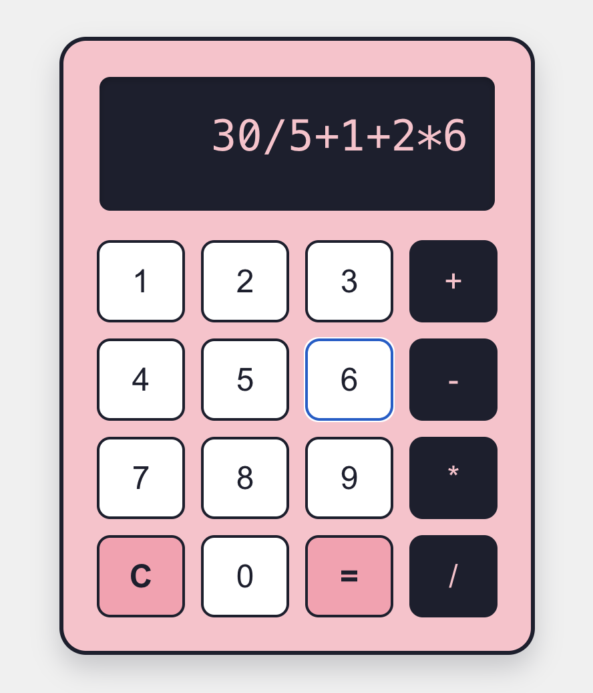

# Welcome to My Reactjs Calculator

---

## Task

In this quest, the challenge was to create a simple calculator web application using ReactJS that supports:

- Basic arithmetic operations: `+`, `-`, `*`, `/`
- A user-friendly interface to input expressions and view results

## Description

This project marks the first step into building a real-world User Interface with React. The calculator is a single-route ReactJS application built using React functional components and hooks (useState). It demonstrates the following:

- Component structure (Calculator, Display, Button)
- State management using useState
- Custom styling using CSS modules
- Custom logic for safe and accurate expression evaluation without relying on eval()
- Prevents invalid expressions like multiple operators in a row (e.g., `++`, `*-`)
- Hosted online: https://my-reactjs-calculator-w9b2.vercel.app/

**[Try My Calculator Live on Vercel!](https://my-reactjs-calculator-w9b2.vercel.app/)**

[](https://my-reactjs-calculator-w9b2.vercel.app/)

**Why eval() was not used**

Initially, I considered using eval() to evaluate the math expression because it's simple and built-in. However, I decided against it because:

- It's unsafe – it can execute arbitrary or harmful code,
- It's considered bad practice in JavaScript projects.
  Instead, I implemented a custom calculate(expression) function that safely parses and evaluates the input step-by-step using operator precedence.

## Installation

To set up this project locally, follow these steps:

```bash
git clone <repository_url>
cd my-react-calculator
npm install
```

## Usage

To run the calculator:

```bash
npm run dev
```

This will launch the calculator app in your default browser. You can click on the buttons to form an expression and press = to get the result.

### The Core Team

Author:
Katrina Pastore Ozolina
Qwasar Project: My Reactjs Calculator

<span><i>Made at <a href='https://qwasar.io'>Qwasar SV -- Software Engineering School</a></i></span>
<span></span>
